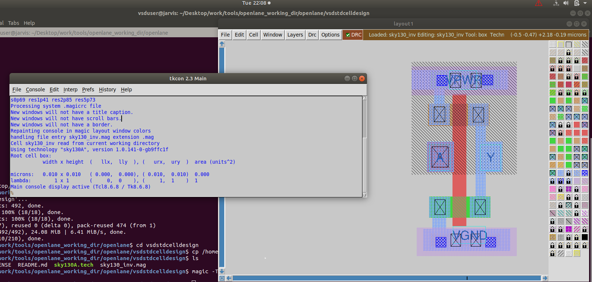

# Day3 :  Design library cell using Magic Layout and ngspice characterization

## Theory :

##  Design Library cell using Magic Layout & NGSpice Characterization:
### <ins>SPICE Deck creation for CMOS Inverter:</ins>
A SPICE deck is a text file used for circuit simulation that lists all circuit elements (like resistors, transistors, capacitors) with their connections, values, and the nodes that link them together. <br>

 <br>

 <br>

### <ins>16-Mask CMOS Process:</ins>
#### 1. **<ins>Selecting a substrate:</ins>**
   - The substrate acts as the foundational layer upon which transistors and other components are built
   - Substrate doping should be less than 'well' doping.
     
#### 2. **<ins>Creating an active region for transistors:</ins>**
   - The active region is formed in specific areas of the substrate where the transistor's source, drain, and channel will be created.
   - This is accomplished by defining regions on the silicon wafer through processes such as oxidation, doping (adding impurities), and photolithography to selectively modify conductivity in those areas

 <br>

#### 3. **<ins>Local Oxidisation of Silicon:</ins>**
   - In LOCOS, a silicon wafer is selectively oxidized by masking the regions where devices will be formed, then growing a thick silicon dioxide (field oxide) in non-active areas to electrically separate adjacent devices.
   - The bird's beak in LOCOS is the tapered, encroaching shape of the silicon dioxide field oxide that grows laterally under the nitride mask during local oxidation. <br>
   


#### 4. **<ins>Formation of N-well and P-well:</ins>**
   - The process includes oxidation to grow SiO2 layers, photolithography for masking the well areas, ion implantation to dope the wells, annealing to activate the dopants, and subsequent steps for transistor gate, source, and drain formation <br>

 <br>

#### 5. **<ins>Formation of Gate Terminal:</ins>**
   - A thin layer of gate oxide (SiO2) is thermally grown on the silicon substrate, which acts as the insulating layer for the gate.
   - A layer of polysilicon is then deposited over the oxide, patterned using photolithography, and etched to form the gate electrode, serving as the control terminal for the transistor.


#### 6. **<ins>Lightly Doped Drain Formation:</ins>**
   - Lightly Doped Drain (LDD) formation begins by implanting a lightly doped impurity region adjacent to the transistor gate using the gate as a mask, reducing the electric field near the drain edge and mitigating hot carrier effects.
   - After forming this region, sidewall spacers are created by depositing and etching a conformal layer around the gate edges; these spacers serve as a mask for subsequent heavy doping of the source and drain regions, completing the LDD structure.

 **<ins>NOTE:</ins>**
1. **Plasma Anisotropic Etching** - It's a dry etching technique used in semiconductor manufacturing where ions generated in a plasma are directionally accelerated toward the substrate to etch material primarily in a vertical direction. This produces highly controlled, vertical sidewalls with minimal lateral etching, essential for fabricating precise micro- and nanoscale features. <br>

2. **Hot Electron Effect** - Occurs in MOSFETs when electrons gain high kinetic energy near the drain due to strong electric fields, causing impact ionization and injection of electrons into the gate oxide. This leads to gate oxide damage, threshold voltage shift, and reduced transistor lifetime. <br>

3. **Short Channel Effect** - As transistor channel length decreases, the control of the gate over the channel diminishes, causing threshold voltage reduction, increased leakage currents, drain-induced barrier lowering (DIBL), and degradation of device performance. This effect limits device scaling. <br>

#### 7. **<ins>Source and Drain Formation:</ins>**
   - Source and drain formation involves doping specific regions on the silicon substrate by ion implantation or diffusion to create highly doped n+ or p+ areas adjacent to the transistor channel.
   - These regions serve as the terminals for current flow, enabling electron or hole injection when the transistor is operational.
  


#### 8. **<ins>Steps to form contacts & interconnects:</ins>**
   - Etch thin oxide in HF solution
   - Deposit titanium on the wafer surface, using sputtering
   - Wafer heated at about $$650 - 700\^\circ \text{C}$$ in N₂ ambient for 60s


#### 9. **<ins>Higher level metal formation:</ins>**
   - 1 micrometer of SiO₂ doped with phosphorus or boron is deposited on the wafer surface
   - Chemical mechanical polishing (CMP) technique for planarizing the wafer surface
  
 <br>

for further information view this :


* Section 3 - Tasks 1 to 5 files, reports and logs can be found in the following folder:

[Section 3 - Tasks 1 to 5 \(vsdstdcelldesign\)](https://github.com/fayizferosh/soc-design-and-planning-nasscom-vsd/tree/main/Desktop/work/tools/openlane_working_dir/openlane/vsdstdcelldesign)

* Section 3 - Task 6 files, reports and logs can be found in the following folder:

[Section 3 - Task 6 \(drc_tests\)](https://github.com/fayizferosh/soc-design-and-planning-nasscom-vsd/tree/main/drc_tests)


### Overview :

1. Clone custom inverter standard cell design from github repository: [Standard cell design and characterization using OpenLANE flow](https://github.com/nickson-jose/vsdstdcelldesign).
2. Load the custom inverter layout in magic and explore.
3. Spice extraction of inverter in magic.
4. Editing the spice model file for analysis through simulation.
5. Post-layout ngspice simulations.
6. Find problem in the DRC section of the old magic tech file for the skywater process and fix them.

---

1. Clone custom inverter standard cell design from github repository

Navigate to directory :
```bash
# Change directory to openlane
cd Desktop/work/tools/openlane_working_dir/openlane
```
Clone the repository with custom inverter design
```bash
git clone https://github.com/nickson-jose/vsdstdcelldesign
```
Change into repository directory:

```bash

cd vsdstdcelldesign
```

Copy magic tech file to the repo directory for easy access
```bash
cp /home/vsduser/Desktop/work/tools/openlane_working_dir/pdks/sky130A/libs.tech/magic/sky130A.tech .
```

Check contents whether everything is present
```bash
ls
```

Command to open custom inverter layout in magic
```bash

magic -T sky130A.tech sky130_inv.mag &
```


custom inverter layout in magic and NMOS and PMOS identified :



### Running Design Rule Check (DRC)

Magic provides built-in DRC features that verify the design against Sky130A technology constraints.

```bash
drc check
drc why
```


### Extracting the SPICE Netlist
Once the layout is DRC-clean, the next step is to generate its SPICE netlist for circuit-level verification.

```bash
extract all
ext2spice cthresh 0 rthresh 0
ext2spice
```


### Editing SPICE for Transient Simulation

Modify the generated netlist to include input sources, power rails, and transient analysis commands.

```
* SPICE3 netlist for sky130_inv.ext - tech: sky130A

.option scale=0.01u
.include libs/pshort.lib
.include libs/nshort.lib

M1000 Y A VPWR VPWR pshort_model.0 w=37 l=23
M1001 Y A VGND VGND nshort_model.0 w=35 l=23

VDD VPWR 0 3.3V
VSS VGND 0 0V
Va A VGND PULSE(0 3.3 0 0.1ns 0.1ns 2ns 4ns)

.tran 1n 20n
.control
run
.endc
.end
```


### Simulating in NGSPICE
Run the transient analysis and visualize the inverter’s switching waveform.

```bash
ngspice sky130_inv.spice
```


