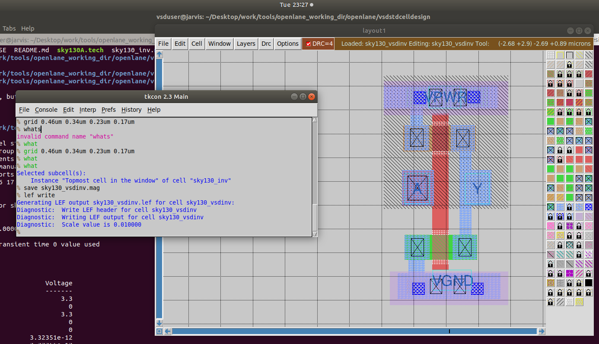
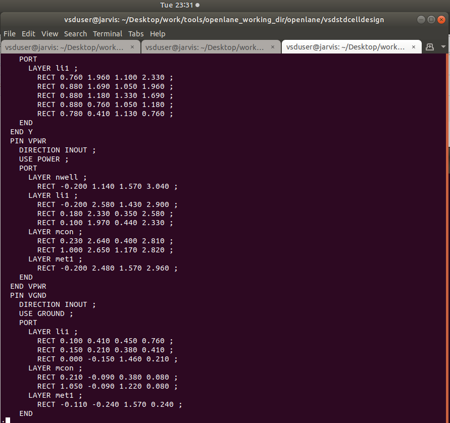

# Day4 :  Pre-layout timing analysis and importance of good clock tree

In console area, type the following
```bash
help grid
```



## Port Attributes Configuration
**Port Properties:**

- Port Class: Input, Output, Inout
- Port Use: Signal, Power, Ground, Clock
- Layer Attachment: Which metal layer the port connects to
- Port Name: A, Y, VPWR, VGND

---

## Port Class and Use Settings
```
grid 0.46um 0.34um 0.23um 0.17um
whats
```


in console
