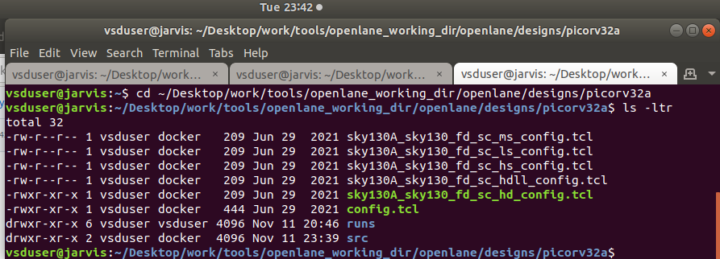
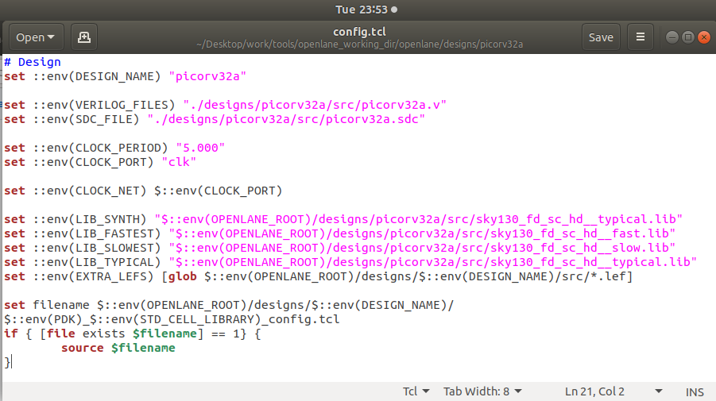
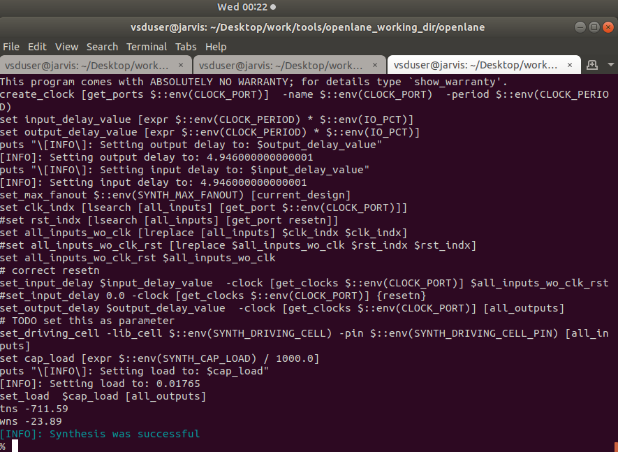

# Day4 :  Pre-layout timing analysis and importance of good clock tree

In console area, type the following
```bash
help grid
```


## Port Attributes Configuration
**Port Properties:**

- Port Class: Input, Output, Inout
- Port Use: Signal, Power, Ground, Clock
- Layer Attachment: Which metal layer the port connects to
- Port Name: A, Y, VPWR, VGND

---

## Port Class and Use Settings
```
grid 0.46um 0.34um 0.23um 0.17um
whats
```


in console

```bash
save sky130_vsdinv.mag
lef write
```


Viewing Generated LEF File Commands to Open LEF:
```bash
cd vsdstdcelldesign
less sky130_vsdinv.lef
```
Opening LEF File:


Custom Cell Integration into OpenLane
3.1 Copying LEF File to Design Source
Copy Command:
```bash
cp sky130_vsdinv.lef ~/Desktop/work/tools/openlane_working_dir/openlane/designs/picorv32a/src/
```

Enter into `~/Desktop/work/tools/openlane_working_dir/openlane/designs/picorv32a` and paste these files there :
check it :

```bash
ls -ltr
```


 ### Modifying config.tcl :

Configuration Updates:

```bash
# Design
set ::env(DESIGN_NAME) "picorv32a"

set ::env(VERILOG_FILES) "./designs/picorv32a/src/picorv32a.v"
set ::env(SDC_FILE) "./designs/picorv32a/src/picorv32a.sdc"

set ::env(CLOCK_PERIOD) "5.000"
set ::env(CLOCK_PORT) "clk"

set ::env(CLOCK_NET) $::env(CLOCK_PORT)

set ::env(LIB_SYNTH) "$::env(OPENLANE_ROOT)/designs/picorv32a/src/sky130_fd_sc_hd__typical.lib"
set ::env(LIB_FASTEST) "$::env(OPENLANE_ROOT)/designs/picorv32a/src/sky130_fd_sc_hd__fast.lib"
set ::env(LIB_SLOWEST) "$::env(OPENLANE_ROOT)/designs/picorv32a/src/sky130_fd_sc_hd__slow.lib"
set ::env(LIB_TYPICAL) "$::env(OPENLANE_ROOT)/designs/picorv32a/src/sky130_fd_sc_hd__typical.lib"
set ::env(EXTRA_LEFS) [glob $::env(OPENLANE_ROOT)/designs/$::env(DESIGN_NAME)/src/*.lef]

set filename $::env(OPENLANE_ROOT)/designs/$::env(DESIGN_NAME)/$::env(PDK)_$::env(STD_CELL_LIBRARY)_config.tcl
if { [file exists $filename] == 1} {
	source $filename
}
```



as we know that just overwrite the run folder which contains all the process and files by using the commands in day 1
```bash
docker
./flow.tcl -interactive
package require openlane 0.9
prep -design picorv32a -tag 11-11_15-16 -overwrite

```

### Adding Custom LEF to Merged LEF

Additional Commands:
```bash
set lefs [glob $::env(DESIGN_DIR)/src/*.lef]
add_lefs -src $lefs
```

### Running Synthesis with Custom Cell

Synthesis Command:
```bash
run_synthesis
```

